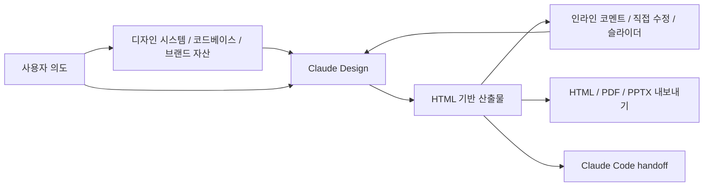

Anthropic은 2026년 4월 17일, Anthropic Labs의 연구 미리보기 제품으로 [Claude Design](https://www.anthropic.com/news/claude-design-anthropic-labs)을 공개했습니다.
공식 소개에 따르면 Claude Design은 디자인, 프로토타입, 슬라이드, 원페이저를 대화로 만들고, 최종 결과를 HTML, PDF, PPTX로 내보내거나 Claude Code로 넘길 수 있습니다.

동시에 GitHub에는 Claude Design의 시스템 프롬프트라고 주장하는 [공개 텍스트](https://github.com/elder-plinius/CL4R1T4S/blob/main/ANTHROPIC/Claude-Design-Sys-Prompt.txt)가 올라와 있습니다.
이 문서는 공식 문서가 아니므로, 현재 운영 중인 프롬프트와 100% 동일하다고 단정할 수는 없습니다.
다만 Anthropic의 공식 발표, 도움말 문서와 상당히 잘 맞물리기 때문에, 제품 철학을 읽는 용도로는 꽤 흥미로운 자료입니다.

이 글에서는 공식 발표와 도움말 문서를 기준으로 사실을 잡고, 공개된 시스템 프롬프트가 무엇을 시사하는지 해석해보겠습니다.

## 한 문장 요약

Claude Design은 단순히 “예쁜 UI를 그려주는 모델”이라기보다, **조직의 디자인 시스템을 읽고 HTML 기반 산출물로 탐색하고 검증하고 핸드오프하는 디자인 에이전트**에 가깝게 보입니다.

## Claude Design은 사실상 HTML 기반 디자인 런타임이다

공개된 프롬프트에서 가장 먼저 눈에 띄는 점은, Claude Design이 자신을 그래픽 툴이 아니라 **HTML로 산출물을 만드는 디자이너**로 규정한다는 점입니다.

이건 꽤 중요합니다.

왜냐하면 이 정의 하나로 Claude Design의 출력 형식이 설명되기 때문입니다.

- 프로토타입을 만들 수 있음
- 슬라이드를 만들 수 있음
- 원페이저를 만들 수 있음
- 최종 결과를 HTML로 내보낼 수 있음
- Claude Code로 handoff할 수 있음

즉, Claude Design의 내부 기본 단위는 정적인 이미지가 아니라 실행 가능한 문서에 더 가깝습니다.

공식 발표도 이 해석을 뒷받침합니다.
Anthropic은 Claude Design이 시각 작업을 생성한 뒤, 대화와 인라인 코멘트, 직접 편집, 조절 슬라이더를 통해 계속 수정된다고 설명합니다.
이런 상호작용은 결국 캔버스 위 픽셀보다, 구조를 가진 DOM 쪽과 더 잘 맞습니다.

이 관점에서 보면 Claude Design은 “AI가 대신 Figma를 그려주는 툴”이라기보다, **디자인을 실행 가능한 프런트엔드 산출물로 취급하는 시스템**에 가깝습니다.

## 진짜 핵심은 모델이 아니라 디자인 시스템 주입이다

공식 도움말 문서를 보면 Claude Design은 조직의 코드베이스, 슬라이드 덱, 브랜드 가이드, 디자인 레퍼런스를 읽어 재사용 가능한 컴포넌트, 색상, 타이포그래피, 레이아웃 패턴을 추출해 디자인 시스템을 만든다고 설명합니다.

여기서 중요한 포인트는 두 가지입니다.

1. Claude Design은 빈 화면에서 바로 시작하는 도구가 아닙니다.
2. 팀 맥락이 들어가야 비로소 좋은 출력이 나온다고 전제합니다.

관리자 가이드도 이 점을 아주 명확하게 말합니다.
디자인 시스템 없이 Claude Design을 켜면 결과물은 기능적일 수는 있어도, 브랜드를 반영하지 못한 “generic” 출력이 된다고 안내합니다.

공개 프롬프트 역시 같은 방향입니다.
사용자 요구를 이해한 뒤, 관련된 디자인 시스템 정의와 연결된 파일을 읽고, 필요한 리소스를 현재 프로젝트로 복사하라고 유도합니다.
즉 이 제품은 프롬프트 엔지니어링보다 **컨텍스트 흡수 능력**을 더 중요한 축으로 두고 있습니다.

이건 Claude Code와도 닮아 있습니다.
좋은 코딩 결과를 위해 코드베이스 컨텍스트가 중요하듯, 좋은 디자인 결과를 위해 디자인 시스템 컨텍스트가 중요하다는 접근입니다.

## 상호작용 단위가 프롬프트가 아니라 화면 요소다

공개 프롬프트를 보면 Claude Design은 사용자가 화면에서 특정 요소를 클릭하거나 드래그하거나 코멘트로 지목했을 때, 그 요소의 런타임 정보와 DOM 조상 구조, React 컴포넌트 계층 같은 단서를 바탕으로 어느 부분을 수정해야 할지 추적하도록 설계되어 있습니다.

이 역시 공식 문서와 잘 맞습니다.
Anthropic은 Claude Design의 기본 인터페이스를 왼쪽 채팅, 오른쪽 캔버스로 설명하고, 다음 같은 수정 방식을 강조합니다.

- 전체 방향을 바꾸는 채팅 수정
- 특정 요소를 찍는 인라인 코멘트
- 캔버스 상의 직접 텍스트 편집
- 색상, 간격, 레이아웃을 조절하는 live controls

이 구조는 꽤 인상적입니다.

보통 AI 디자인 도구를 떠올리면 “프롬프트 한 번 넣고 결과 이미지 여러 장을 받는 모델”을 상상하기 쉽습니다.
그런데 Claude Design은 그보다 훨씬 더 **문서 편집기 + 프로토타입 런타임 + 코드 인지형 에이전트**에 가깝습니다.

이 방식의 장점은 분명합니다.

- 수정 요청이 더 국소적이 됩니다.
- “왼쪽 위 카드의 패딩만 조금 줄여줘” 같은 피드백이 쉬워집니다.
- 나중에 Claude Code로 넘길 때, 의도가 더 구조적으로 전달될 가능성이 높습니다.

## Claude Design은 정답 생성보다 탐색을 우선한다

Anthropic의 공식 발표는 Claude Design이 디자이너에게 더 넓은 탐색 공간을 준다고 설명합니다.
경험 많은 디자이너조차 실제 업무에서는 충분히 많은 방향을 시험해보지 못하는데, Claude Design이 그 병목을 줄여준다는 이야기입니다.

공개 프롬프트도 거의 같은 철학을 드러냅니다.

- 새 작업이면 질문을 충분히 하라
- 사용자가 몇 개의 변형을 원하는지 물어보라
- 시각, 상호작용, 카피 중 어디를 다양화할지 확인하라
- 옵션은 2~3개, 혹은 그 이상 제시하라
- 하나의 완성본보다 여러 tweak를 한 파일 안에서 토글 가능하게 두라

이건 제품 포지셔닝 측면에서 매우 좋은 선택처럼 보입니다.
디자인 작업은 정답 맞히기보다 비교와 선택의 과정이기 때문입니다.

특히 공식 도움말에서 “2~3개의 대안을 보여달라고 요청하라”, “Claude에게 접근성이나 정보 위계 관점의 피드백도 요청하라”라고 안내하는 대목은, Claude Design을 생성기보다 **디자인 협업자**로 배치하고 있음을 보여줍니다.

## 검증과 handoff가 처음부터 워크플로에 들어가 있다

공개 프롬프트에서 가장 흥미로운 대목 중 하나는, 작업을 마치면 결과 파일을 사용자에게 보여주고 오류가 없는지 확인한 뒤, 별도 검증 에이전트를 호출하라는 흐름입니다.

이건 단순히 “그럴듯하게 보여주는 데모”를 넘어서, **실행 가능한 결과물을 QA 가능한 대상으로 본다**는 의미입니다.

공식 발표도 같은 방향입니다.
Claude Design은 결과를 HTML, PDF, PPTX로 내보낼 수 있고, 디자인이 준비되면 Claude Code로 넘길 수 있는 handoff bundle을 만든다고 설명합니다.

여기서 중요한 건 handoff의 단위입니다.
이미지 한 장이 아니라, 의도와 구조를 가진 산출물이 넘어간다는 점입니다.

이 구조가 잘 작동한다면 워크플로는 이렇게 바뀔 수 있습니다.

1. PM이나 디자이너가 Claude Design에서 흐름과 화면을 탐색합니다.
2. 팀 디자인 시스템을 반영한 프로토타입을 빠르게 만듭니다.
3. 코멘트와 조절값으로 세부를 다듬습니다.
4. 그대로 Claude Code에 handoff해서 실제 구현으로 이어갑니다.

즉 디자인과 구현 사이에 있는 번역 비용을 줄이려는 시도입니다.

## 이 프롬프트가 보여주는 운영 조건도 있다

공개 프롬프트와 공식 도움말을 함께 보면 Claude Design의 운영 조건도 읽힙니다.

첫째, **디자인 시스템 세팅이 사실상 필수**입니다.
공식 관리자 가이드는 rollout 순서 자체를 디자인 시스템 설정부터 시작하라고 권합니다.

둘째, **큰 코드베이스는 바로 넣기 어렵습니다**.
도움말은 매우 큰 레포를 연결하면 브라우저 지연이나 문제가 생길 수 있으니, 전체 모노레포보다 필요한 하위 디렉터리를 연결하라고 안내합니다.

셋째, **데이터 거버넌스 검토가 필요합니다**.
관리자 가이드에 따르면 업로드한 자산은 지속 저장되며, 현재는 데이터 레지던시 요구사항을 지원하지 않습니다.
엔터프라이즈 입장에서는 이 부분이 매우 중요합니다.

넷째, **현재는 웹 인터페이스 중심 제품**입니다.
관리자 가이드는 Claude Design이 현재 `claude.ai/design` 웹 인터페이스를 통해 제공된다고 설명합니다.

즉 Claude Design은 단지 모델 성능만으로 평가할 수 있는 제품이 아니라, 조직의 브랜드 자산과 디자인 자산을 어떻게 흡수하고 통제하느냐까지 포함하는 제품입니다.

## 내가 흥미롭게 보는 지점

제가 특히 흥미롭게 보는 부분은 Claude Design이 디자인 산출물을 점점 코드에 가까운 형태로 다룬다는 점입니다.

기존 디자인 도구의 산출물은 종종 개발로 넘어가는 순간 많은 정보가 소실됩니다.
간격, 상태 변화, 인터랙션 의도, 반응형 규칙, 컴포넌트 재사용 범위 같은 것들이 별도 대화로 다시 번역됩니다.

그런데 Claude Design은 처음부터 HTML 기반 결과물, 인라인 코멘트, 조절 가능한 tweak, Claude Code handoff를 전제로 설계된 것처럼 보입니다.
이 방향이 맞다면, 디자인 파일과 구현 코드 사이의 간극은 지금보다 꽤 많이 줄어들 수 있습니다.

물론 아직 확인해야 할 것도 많습니다.

- 디자인 시스템 추출 품질은 어느 정도인가
- 스크린샷 기반 입력보다 코드베이스 기반 입력이 얼마나 더 좋은가
- handoff bundle이 실제 구현 단계에서 얼마나 유용한가
- 디자이너가 DOM 중심 산출물을 얼마나 자연스럽게 받아들일 수 있는가

하지만 적어도 공개된 프롬프트와 공식 문서를 함께 읽어보면, Claude Design의 방향은 제법 선명합니다.

Claude Design은 단순한 “AI 디자인 생성기”라기보다,
**조직 컨텍스트를 먹고, HTML 산출물 위에서 탐색하고, 검증 후 구현 에이전트로 넘기는 디자인 실행 환경**으로 읽는 편이 더 정확해 보입니다.

## 참고 자료

- [Introducing Claude Design by Anthropic Labs](https://www.anthropic.com/news/claude-design-anthropic-labs)
- [Claude Design 시스템 설정 가이드](https://support.claude.com/zh-TW/articles/14604397-%E5%9C%A8-claude-design-%E4%B8%AD%E8%A8%AD%E5%AE%9A%E6%82%A8%E7%9A%84%E8%A8%AD%E8%A8%88%E7%B3%BB%E7%B5%B1)
- [Claude Design Team / Enterprise 관리자 가이드](https://support.claude.com/ja/articles/14604406-claude-design-%E7%AE%A1%E7%90%86%E8%80%85%E3%82%AC%E3%82%A4%E3%83%89-team-%E3%81%8A%E3%82%88%E3%81%B3-enterprise-%E3%83%97%E3%83%A9%E3%83%B3%E5%90%91%E3%81%91)
- [공개된 Claude Design 시스템 프롬프트](https://github.com/elder-plinius/CL4R1T4S/blob/main/ANTHROPIC/Claude-Design-Sys-Prompt.txt)
