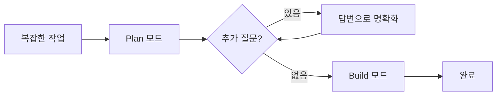

코딩 에이전트와 함께하는 개발은 몇 달 전과 비교해도 180도 달라졌습니다.

불과 1년 전만 해도 모델은 거의 에이전트적이지 않았습니다. 도구 호출에 서툴렀고, 빈번하게 코드를 환각했습니다.
최신 모델은 더 똑똑한 지식을 가졌을 뿐만 아니라, 지시를 더 잘 따르고 도구 호출도 더 능숙합니다.

최신 모델이 Cursor, Codex, Claude Code, Antigravity 등 여러 코딩 에이전트 서비스에서 더 잘 활용되고 있습니다.
초기 컨텍스트 윈도우를 위해 모델에 자체 요약을 허용하고 계속 진행하게 하는 것, 컨텍스트 사용량을 줄이기 위해 도구 정의와 응답 크기를 조절하는 것, 파일 시스템에서 컨텍스트를 동적으로 로드하는 것 등 작은 디테일들이 모여 큰 차이를 만듭니다.

코딩 에이전트 서비스를 사용하는 개발자들은 현재 도구의 강점과 한계를 배우고 있습니다. 세부적인 계획을 먼저 세운 뒤 코드를 생성하는 것이 결과를 크게 개선합니다.
내년에 훨씬 더 많은 개발자들이 AI로 코드를 작성할 것으로 예상합니다.

이 글은 Cursor에서 에이전트를 어떻게 사용하는지에 대한 개인적인 경험을 정리한 글입니다.

## 모델 선택 전략

Opus 4.5와 Codex(ex: GPT-5.1 Codex Max)를 번갈아가면서 사용했습니다.

| 모델         | 특징              | 사용 시점               |
| ------------ | ----------------- | ----------------------- |
| **Opus 4.5** | 글쓰기, 계획 수립 | Plan 모드, 문서 작성    |
| **Codex**    | 장시간 작업       | Build 모드, 대규모 구현 |

Opus 4.5는 글쓰기에 뛰어납니다. 계획을 세우거나, 문서를 작성하거나, 코드 설명이 필요할 때 사용합니다.

Codex는 장시간 작업에 유리합니다. [Lee Robinson의 경험](https://leerob.com/pixo)에 따르면, 가장 긴 에이전트가 3시간 동안 실행되었다고 합니다. 키보드에서 떨어져 있는 동안에도 에이전트가 작업을 수행할 수 있습니다.

## 워크플로우

복잡한 개발 업무를 진행할 때는 두 단계로 나눕니다: Plan + Build

## Plan 모드

<Video src="/post/blog/use-agents-first/agent-todo.mp4" />

[Plan 모드](https://cursor.com/docs/agent/planning)는 Cursor에서 가장 과소평가된 기능 중 하나입니다.

Plan 모드는 코드를 작성하기 전에 상세한 구현 계획을 만듭니다. 에이전트가 질문과 컨텍스트를 분석하여 필요한 사항을 확인하며, 빌드 전에 편집할 수 있는 계획을 생성합니다.
구조화된 Todo 리스트와 메시지 큐를 사용해 선제적으로 계획하고 복잡한 작업을 관리하여, 장시간 진행되는 과제를 더 쉽게 파악하고 추적할 수 있습니다.

Plan 모드를 사용할 때는 **Opus 4.5** 모델을 사용합니다. Opus 4.5는 글쓰기에 뛰어나기 때문에 계획을 수립하는 데 적합합니다.

## Build 모드

Plan 모드를 통해 수립된 계획을 코딩 에이전트로 수행합니다.

Build를 실행할 때는 **Codex** 모델을 사용합니다. 장시간 작업에 유리하기 때문입니다. 클라우드(샌드박스)에서 에이전트를 실행될 수 있습니다. 다른 일을 하다가 돌아와서 PR을 확인하고 머지하는 식으로 작업할 수 있습니다.

### 클라우드 에이전트

[클라우드 에이전트](https://cursor.com/ko/docs/cloud-agent)는 분리된 Ubuntu 기반 머신에서 실행됩니다.

Github또는 Gitlab과 연결될 수 있고, 연결된 레포에서 클론한 뒤 별도 브랜치에서 작업하고 변경 사항을 해당 레포로 푸시합니다.

## 검증

이렇게 생각할 수도 있습니다: _과연 이렇게 했을 때 코드가 이상하게 작성되거나 원하지 않는 결과로 끝나지 않을까?_  
이를 위해 모델이 자신의 작업이 올바른지 검증할 수단이 필요합니다.

에이전트가 코드를 깨뜨리지 않고 계속 작업하게 하려면, **검증 가능해야** 합니다. 프로젝트에 테스트, 린트와 같은 검증 가능한 프로세스를 추가하면, 에이전트가 실수로부터 배우고 올바른 결과를 낼때까지 계속 작업할 수 있습니다.
그래서 프로젝트 초기에 포맷, 린트, 테스트하는 CI를 추가하는게 중요합니다.

프로젝트 수준의 작업을 진행하고 있다면, 프로젝트 초기에 포맷, 린트, 테스트를 하는 CI 작업을 추가하세요.
그러면 그 이후에는 에이전트가 작업한 모든 결과물이 PR에서 실행되어, 에이전트가 회귀를 일으키지 않도록 보장할 수 있습니다.

## 이른 최적화를 피하세요

코딩 에이전트와 AI 사용시 최적의 워크플로우와 전략에 대한 논의가 많이 있습니다.

여기서 하고 싶은 말은 **과도하게 처음부터 최적화하지 말라**는 것입니다.

- 린트, 포맷팅, 테스트 등 초기 규칙 설정 없이 시작해도 됩니다
- 에이전트가 반복적으로 잘못 이해한 경우에 규칙을 추가해도 됩니다
- 워크플로우는 실제로 작업하면서 자연스럽게 점진적으로 형성될 것입니다

## 정리

새로운 기술을 배우는 것처럼, 이 새로운 도구를 최적으로 활용하는 방법을 배우기 위한 좋은 시기입니다.

처음에는 낯설고 과거에 소프트웨어를 만들던 방식과 매우 다르게 느껴질 것입니다.
하지만 지금이 새로운 도구들을 최적으로 활용하는 방법을 배울 때입니다.

**코딩 에이전트를 지금 당장 사용해보세요.**

## 참고 자료

- [Lee Robinson - Building low-level software with only coding agents](https://leerob.com/pixo)
- [Cursor 공식 문서](https://docs.cursor.com/ko)
