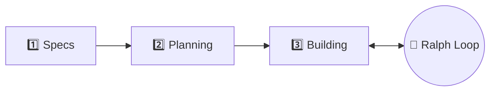
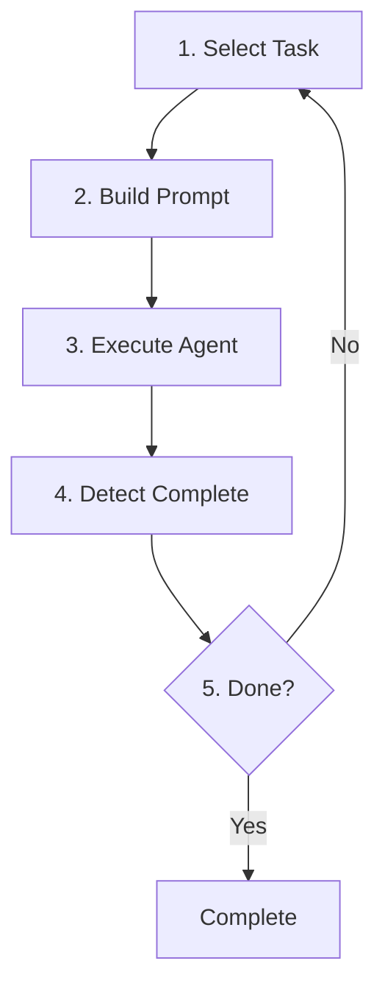

> "Ralph is a Bash loop" — Geoffrey Huntley

현재(글 작성 시점: 2026년 1월), 개발자 커뮤니티에서 가장 뜨거운 화제는 단연 **Ralph Loop**(또는 Ralph Wiggum 기법)입니다.
심슨 가족의 캐릭터 이름을 딴 이 기법은 AI 코딩 에이전트를 자율적으로 반복 실행하여 복잡한 작업을 완료할 때까지 계속 작업하게 하는 혁신적인 방법론입니다.

이 가이드에서는 Ralph Loop의 핵심 개념부터 실제 사용 가능한 도구들, 그리고 동작하는 예시 코드까지 상세히 다룹니다.

## 1. Ralph Loop란 무엇인가?

Ralph Loop는 Geoffrey Huntley가 창안한 자율 AI 개발 방법론입니다. 가장 순수한 형태는 놀라울 정도로 단순합니다:

```bash
while :; do cat PROMPT.md | claude-code ; done
```

이것이 전부입니다. AI 에이전트에게 동일한 프롬프트를 반복적으로 제공하고, 에이전트가 작업을 완료할 때까지 계속 실행합니다.

### 핵심 아이디어

전통적인 AI 코딩 세션의 문제점은 다음과 같습니다:

- AI가 "완료됐다"고 생각하면 작업을 중단함
- 긴 대화에서 컨텍스트 오염(context pollution)이 발생
- 실패한 시도들이 대화 히스토리에 누적되어 AI가 혼란스러워함

Ralph의 해결책은 간단합니다:

- **진행 상태는 파일과 Git에 저장** (LLM 컨텍스트 윈도우가 아닌)
- **컨텍스트가 채워지면 새로운 에이전트로 교체** (신선한 컨텍스트)
- **이전 반복의 작업물을 파일 시스템에서 읽어서 계속 진행**

## 2. 왜 Ralph Loop가 필요한가?

### 전통적인 AI 코딩의 한계

1. **조기 종료**: AI가 "충분하다"고 생각하면 작업 완료 전에 중단
2. **단일 프롬프트의 취약성**: 복잡한 작업을 단일 프롬프트로 완료할 수 없음
3. **재프롬프팅 비용**: 매번 수동으로 다시 지시해야 함
4. **컨텍스트 손실**: 대화가 재시작되면 이전 진행 상황을 잃음

### Ralph의 장점

- **$50,000 계약 작업을 $297 API 비용으로 완료** (실제 사례)
- **밤새 6개 저장소를 배포** (Y Combinator 해커톤 사례)
- **복잡한 마이그레이션 자동화**: Jest → Vitest, 프레임워크 업그레이드 등

## 3. 핵심 철학과 원칙

### "결정론적으로 나쁨이 비결정론적인 세계에서 더 낫다"

이것이 Ralph의 핵심 철학입니다. 첫 시도에 완벽할 필요 없습니다. 반복이 작업을 다듬어 줍니다.

### 3단계 워크플로우



### 주요 원칙

1. **루프 위에 앉아라, 안에 앉지 마라**: 에이전트가 작업하게 두고, 환경을 엔지니어링하라
2. **역압력(Backpressure)이 방향보다 낫다**: 테스트, 타입체크, 린트로 잘못된 결과를 자동 거부
3. **계획은 일회용**: 표류하는 계획을 살리는 것보다 재생성이 저렴함
4. **실패는 데이터다**: 각 반복이 실패를 기반으로 접근 방식을 개선

## 4. 주요 도구 및 플러그인

### 4.1 Claude Code 공식 플러그인 (ralph-wiggum)

**가장 공식적이고 널리 사용되는 구현체**

- GitHub: [anthropics/claude-code/plugins/ralph-wiggum](https://github.com/anthropics/claude-code/tree/main/plugins/ralph-wiggum)

```bash
# 설치
/plugin install ralph-wiggum@claude-plugins-official

# 의존성 (Windows의 경우 필수)
# jq 먼저 설치 필요
```

**특징:**

- Stop Hook을 사용하여 Claude의 종료 시도를 가로챔
- `--max-iterations`로 안전한 반복 제한
- `--completion-promise`로 완료 조건 지정
- Anthropic 공식 지원

**기본 사용법:**

```bash
/ralph-loop "Your task description" --max-iterations 20 --completion-promise "COMPLETE"
```

### 4.2 Ralph TUI (Terminal UI Orchestrator)

**실시간 시각화와 세션 관리를 제공하는 터미널 UI**

- GitHub: [subsy/ralph-tui](https://github.com/subsy/ralph-tui)
- 문서: [ralph-tui.com](https://ralph-tui.com)

Ralph Loop의 가장 큰 문제점 중 하나는 **작업 추적의 부재**입니다.
Ralph TUI는 이 문제를 해결하는 터미널 기반 오케스트레이터로, AI 코딩 에이전트(Claude Code, OpenCode, Factory Droid)를 작업 트래커(prd.json, Beads)에 연결하여 자율적으로 실행합니다.

```bash
# 설치 (Bun 필요)
bun install -g ralph-tui

# 프로젝트 설정
cd your-project
ralph-tui setup

# AI로 PRD 생성
ralph-tui create-prd --chat

# Ralph 실행!
ralph-tui run --prd ./prd.json
```

**주요 특징:**

- **실시간 TUI 대시보드**: 에이전트 출력, 작업 진행 상황 실시간 확인
- **세션 영속성**: 일시 중지/재개, 크래시 복구 지원
- **다중 에이전트 지원**: Claude Code, OpenCode, Factory Droid
- **다중 트래커 지원**: prd.json (단순), Beads (Git 기반, 의존성 관리)
- **서브에이전트 추적**: 중첩된 에이전트 호출 시각화
- **샌드박스 실행**: `--sandbox` 옵션으로 격리된 환경에서 실행

**실행 흐름:**



### 4.3 Vercel ralph-loop-agent (TypeScript SDK)

**AI SDK와 통합된 TypeScript 구현체**

- GitHub: [vercel-labs/ralph-loop-agent](https://github.com/vercel-labs/ralph-loop-agent)

JavaScript/TypeScript 프로젝트에서 프로그래밍 방식으로 Ralph Loop를 구현하고 싶다면 이 라이브러리가 최적입니다.
Vercel의 AI SDK를 감싸서 검증 콜백과 컨텍스트 요약 기능을 제공합니다.

```bash
npm install ralph-loop-agent
```

**특징:**

- **AI SDK 완전 호환**: AI Gateway 문자열 형식 지원
- **유연한 중단 조건**: 반복 횟수, 토큰, 비용으로 제한 가능
- **컨텍스트 관리**: 장기 실행 루프를 위한 내장 요약 기능
- **검증 콜백**: `verifyCompletion` 함수로 완료 조건 커스터마이징

### 4.4 도구 비교표

| 도구                   | 유형           | 특징                                    | 적합한 사용자               |
| ---------------------- | -------------- | --------------------------------------- | --------------------------- |
| **Claude Code Plugin** | CLI 플러그인   | 공식 지원, Stop Hook                    | Claude Code 사용자          |
| **Ralph TUI**          | 터미널 UI      | 실시간 시각화, 세션 관리, 다중 에이전트 | 시각적 모니터링이 필요한 팀 |
| **ralph-loop-agent**   | TypeScript SDK | 프로그래밍 방식 제어, AI SDK 통합       | Node.js/TypeScript 개발자   |

## 5. 실전 예시: Claude Code로 Ralph Loop 사용하기

### 5.1 기본 설정

먼저 Claude Code CLI를 설치합니다:

```bash
# Claude Code 설치
curl -fsSL https://claude.ai/install.sh | bash

# 인증
claude
```

### 5.2 플러그인 설치 및 사용

```bash
# 플러그인 마켓플레이스 추가
/plugin install marketplace

# Ralph Wiggum 플러그인 설치
/plugin install ralph-wiggum@claude-plugins-official

# 설치 확인
/plugins
```

### 5.3 기본 사용 예시

```bash
# 단순 작업
/ralph-loop "Build a REST API for todos.
When complete:
- All CRUD endpoints working
- Input validation in place
- Tests passing (coverage > 80%)
- README with API docs
- Output: <promise>COMPLETE</promise>" \
--max-iterations 20 \
--completion-promise "COMPLETE"
```

**중요**: `<promise>` 태그는 Ralph Loop가 작업 완료를 감지하는 핵심 메커니즘입니다. 프롬프트에 반드시 `<promise>완료_키워드</promise>` 형태로 포함하고, `--completion-promise` 옵션과 동일한 키워드를 사용해야 합니다.

### 5.4 TDD 기반 개발

```bash
/ralph-loop "Implement user authentication using TDD.
Process:
1. Write failing test for next requirement
2. Implement minimal code to pass
3. Run tests
4. If failing, fix and retry
5. Refactor if needed
6. Repeat for all requirements

Requirements:
- JWT token generation
- Password hashing with bcrypt
- Login/logout endpoints
- Token refresh mechanism

Output <promise>DONE</promise> when all tests green." \
--max-iterations 50 \
--completion-promise "DONE"
```

### 5.5 마이그레이션 작업

```bash
/ralph-loop "Migrate all tests from Jest to Vitest.
Steps:
1. Identify Jest test files
2. Convert imports to Vitest equivalents
3. Update mock syntax
4. Run tests
5. Fix any failing tests
6. Update package.json scripts

Output <promise>MIGRATION_COMPLETE</promise> when:
- All tests converted
- No Jest dependencies remain
- All tests passing" \
--max-iterations 50 \
--completion-promise "MIGRATION_COMPLETE"
```

### 5.6 다단계 프로젝트

```bash
# overnight-work.sh
#!/bin/bash

# Phase 1: 데이터 모델
cd /path/to/project
claude -p "/ralph-loop 'Phase 1: Build data models.
Output <promise>PHASE1_DONE</promise>' --max-iterations 20"

# Phase 2: API 레이어
claude -p "/ralph-loop 'Phase 2: Build API endpoints for existing models.
Output <promise>PHASE2_DONE</promise>' --max-iterations 25"

# Phase 3: 프론트엔드
claude -p "/ralph-loop 'Phase 3: Build UI components.
Output <promise>PHASE3_DONE</promise>' --max-iterations 30"
```

```bash
# 실행
chmod +x overnight-work.sh
./overnight-work.sh
```

### 5.7 루프 취소

```bash
# 실행 중인 Ralph Loop 취소
/cancel-ralph
```

## 6. 실전 예시: Ralph TUI로 시각적 관리하기

Ralph TUI는 Ralph Loop의 "블랙박스" 문제를 해결합니다. 자율 프로세스가 무엇을 하고 있는지 실시간으로 확인할 수 있습니다.

### 6.1 설치

```bash
# Bun 설치 (필수)
# macOS/Linux
curl -fsSL https://bun.sh/install | bash

# Windows
powershell -c "irm bun.sh/install.ps1 | iex"

# Ralph TUI 설치
bun install -g ralph-tui

# 버전 확인
ralph-tui --version
```

### 6.2 프로젝트 설정

```bash
cd your-project

# 인터랙티브 설정 마법사
ralph-tui setup
```

설정 마법사에서 선택할 항목:

- **Issue Tracker**: JSON file (단순) 또는 Beads (Git 기반)
- **AI Agent**: Claude Code (추천), OpenCode, Factory Droid
- **Skills 설치**: `~/.claude/skills/`에 설치됨

### 6.3 PRD 생성

```bash
# AI 대화로 PRD 생성 (추천)
ralph-tui create-prd --chat

# 또는 alias 사용
ralph-tui prime

# 특정 에이전트로
ralph-tui create-prd --agent claude

# 출력 디렉토리 지정
ralph-tui create-prd --output ./docs
```

Claude Code 내에서 직접 스킬 사용:

```bash
# Claude Code에서 슬래시 명령어로 사용
/ralph-tui-prd           # PRD 인터랙티브 생성
/ralph-tui-create-json   # PRD를 prd.json으로 변환
/ralph-tui-create-beads  # PRD를 Beads 이슈로 변환
```

### 6.4 Ralph 실행

```bash
# PRD 파일로 실행
ralph-tui run --prd ./prd.json

# Beads epic으로 실행
ralph-tui run --epic my-epic-id

# 에이전트/모델 오버라이드
ralph-tui run --agent claude --model sonnet
ralph-tui run --agent opencode --model anthropic/claude-3-5-sonnet

# 반복 횟수 제한
ralph-tui run --iterations 10

# 헤드리스 모드 (CI/CD용)
ralph-tui run --headless

# 샌드박스에서 실행 (보안)
ralph-tui run --sandbox
```

### 6.5 TUI 키보드 단축키

실행 중 사용 가능한 키:

| 키  | 동작                   |
| --- | ---------------------- |
| `S` | 서브에이전트 시작/배포 |
| `T` | 서브에이전트 추적 보기 |
| `P` | 일시 중지              |
| `R` | 재개                   |
| `Q` | 종료                   |
| `L` | 로그 보기              |

### 6.6 세션 재개

Ralph TUI는 세션 영속성을 지원합니다. 크래시나 중단 후에도 작업을 이어갈 수 있습니다:

```bash
# 이전 세션 재개
ralph-tui resume

# 세션 상태 확인
ls -la .ralph-tui/
```

### 6.7 설정 파일

`.ralph-tui/config.toml` 또는 `~/.config/ralph-tui/config.toml`:

```toml
# 기본 에이전트
agent = "claude"

# 기본 모델
model = "sonnet"

# 스킬 디렉토리 (커스텀 PRD 스킬용)
skills_dir = "/path/to/my-skills"

# 알림 소리
[notification]
sound = "ralph"  # off, system, ralph

# 로그 설정
[logs]
dir = ".ralph-tui/iterations"
```

### 6.8 실제 사용 예시: Visual Mind Map 앱 생성

```bash
# 1. 프로젝트 생성
mkdir mind-map-app && cd mind-map-app
npm init -y

# 2. Ralph TUI 설정
ralph-tui setup

# 3. PRD 생성 (AI 대화)
ralph-tui create-prd --chat
# AI: "어떤 기능을 원하시나요?"
# User: "visual graph-based thought mapping app that allows creating notes
#        and linking related thoughts"
# AI: "MVP 범위로 할까요?"
# User: "Yes, MVP please"

# 4. Ralph 실행
ralph-tui run --prd ./prd.json

# 5. TUI에서 진행 상황 모니터링...
# 약 1시간 45분 후 완료!
```

---

## 7. 실전 예시: ralph-loop-agent (TypeScript)

TypeScript/JavaScript 프로젝트에서 프로그래밍 방식으로 Ralph Loop를 구현하는 방법입니다.

### 7.1 설치

```bash
npm install ralph-loop-agent
# 또는
yarn add ralph-loop-agent
# 또는
pnpm add ralph-loop-agent
```

### 7.2 기본 사용 예시

```typescript
import { iterationCountIs, RalphLoopAgent } from "ralph-loop-agent"

const agent = new RalphLoopAgent({
  model: "anthropic/claude-opus-4.5",
  instructions: "You are a helpful coding assistant.",
  stopWhen: iterationCountIs(10),
  verifyCompletion: async ({ result }) => ({
    complete: result.text.includes("DONE"),
    reason: "Task completed successfully",
  }),
})

const { text, iterations, completionReason } = await agent.loop({
  prompt: "Create a function that calculates fibonacci numbers",
})

console.log(text)
console.log(`Completed in ${iterations} iterations`)
console.log(`Reason: ${completionReason}`)
```

### 7.3 도구(Tool)와 함께 사용

```typescript
import { tool } from "ai"
import { iterationCountIs, RalphLoopAgent } from "ralph-loop-agent"
import { z } from "zod"

const agent = new RalphLoopAgent({
  model: "anthropic/claude-opus-4.5",
  instructions: "You help users with file operations.",
  tools: {
    readFile: tool({
      description: "Read a file from disk",
      parameters: z.object({ path: z.string() }),
      execute: async ({ path }) => {
        const fs = require("fs").promises
        const content = await fs.readFile(path, "utf-8")
        return { content }
      },
    }),
    writeFile: tool({
      description: "Write content to a file",
      parameters: z.object({
        path: z.string(),
        content: z.string(),
      }),
      execute: async ({ path, content }) => {
        const fs = require("fs").promises
        await fs.writeFile(path, content)
        return { success: true }
      },
    }),
  },
  stopWhen: iterationCountIs(10),
  verifyCompletion: ({ result }) => ({
    complete: result.text.includes("All files updated"),
  }),
})

const stream = await agent.stream({
  prompt: "Build a calculator module with add, subtract, multiply, divide functions",
})

for await (const chunk of stream.textStream) {
  process.stdout.write(chunk)
}
```

### 7.4 마이그레이션 에이전트 예시

```typescript
import { iterationCountIs, RalphLoopAgent } from "ralph-loop-agent"

const migrationAgent = new RalphLoopAgent({
  model: "anthropic/claude-opus-4.5",
  instructions: `You are migrating a codebase from Jest to Vitest.
  
For each iteration:
1. Find one Jest test file that hasn't been migrated
2. Convert it to Vitest syntax
3. Run the tests to verify
4. Move to the next file

When all files are migrated and tests pass, include "MIGRATION_COMPLETE" in your response.`,
  stopWhen: iterationCountIs(50),
  verifyCompletion: ({ result }) => ({
    complete: result.text.includes("MIGRATION_COMPLETE"),
    reason: "All Jest tests migrated to Vitest",
  }),
})

async function runMigration() {
  console.log("Starting Jest to Vitest migration...\n")

  const { text, iterations, completionReason } = await migrationAgent.loop({
    prompt: "Begin the Jest to Vitest migration. Start by analyzing the current test structure.",
  })

  console.log("\n--- Migration Complete ---")
  console.log(`Iterations: ${iterations}`)
  console.log(`Reason: ${completionReason}`)
}

runMigration()
```

### 7.5 스트리밍 출력

```typescript
const stream = await agent.stream({
  prompt: "Build a todo API",
})

// 실시간 출력
for await (const chunk of stream.textStream) {
  process.stdout.write(chunk)
}

// 최종 결과
const result = await stream.finalResult
console.log(`\nCompleted in ${result.iterations} iterations`)
```

**참고**: 스트리밍 모드에서는 검증이 통과하거나 최종 반복에 도달할 때까지 비스트리밍 반복을 실행한 후, 마지막 반복을 스트리밍합니다.

## 8. PRD 기반 작업 관리

Ralph의 핵심은 잘 정의된 PRD(Product Requirements Document)입니다.

### 8.1 효과적인 PRD 작성

```markdown
# Feature: User Authentication

## Overview

Implement secure user authentication with JWT tokens.

## User Stories

### US-001: User Registration

**As a** new user  
**I want to** create an account  
**So that** I can access the application

**Acceptance Criteria:**

- [ ] Email validation
- [ ] Password strength requirements (8+ chars, 1 uppercase, 1 number)
- [ ] Duplicate email check
- [ ] Welcome email sent on success

**Technical Notes:**

- Use bcrypt for password hashing
- Store in PostgreSQL users table

### US-002: User Login

**As a** registered user  
**I want to** log in with my credentials  
**So that** I can access my account

**Acceptance Criteria:**

- [ ] Email/password validation
- [ ] JWT token generation
- [ ] Refresh token mechanism
- [ ] Rate limiting (5 attempts per minute)

### US-003: Password Reset

**As a** user who forgot my password  
**I want to** reset my password  
**So that** I can regain access

**Acceptance Criteria:**

- [ ] Reset email with secure token
- [ ] Token expires in 1 hour
- [ ] Password update functionality
```

### 8.2 JSON 형식 PRD (Ralph TUI용)

```json
{
  "featureName": "User Authentication",
  "branchName": "feature/auth",
  "userStories": [
    {
      "id": "US-001",
      "title": "User Registration",
      "priority": 1,
      "passes": false,
      "acceptanceCriteria": [
        "Email validation",
        "Password strength requirements",
        "Duplicate email check",
        "Welcome email sent"
      ]
    },
    {
      "id": "US-002",
      "title": "User Login",
      "priority": 2,
      "passes": false,
      "acceptanceCriteria": [
        "Email/password validation",
        "JWT token generation",
        "Refresh token mechanism",
        "Rate limiting"
      ]
    }
  ]
}
```

### 8.3 PRD 크기 가이드라인

**중요:** 각 PRD 항목은 단일 컨텍스트 윈도우 내에서 완료될 수 있을 정도로 작아야 합니다.

- ✅ 좋은 예: "POST /users 엔드포인트 구현"
- ❌ 나쁜 예: "전체 인증 시스템 구현"

큰 작업은 더 작은 단위로 나누세요.

## 9. Best Practices와 주의사항

### 9.1 안전 메커니즘

```bash
# 항상 max-iterations 설정
/ralph-loop "..." --max-iterations 20

# Ralph TUI에서도
ralph-tui run --iterations 10

# 비용 모니터링
# Claude Code: ~/.config/claude/usage.json 확인
# API 사용량: Anthropic Console에서 확인
```

### 9.2 효과적인 프롬프트 작성

```markdown
# ✅ 좋은 프롬프트

Build a REST API for todos.

Success Criteria:

- All CRUD endpoints working
- Input validation with Zod
- Tests passing (>80% coverage)
- No TypeScript errors

When complete, output: <promise>DONE</promise>
When stuck after 15 iterations:

- Document blockers
- List attempted solutions
- Suggest alternatives

# ❌ 나쁜 프롬프트

Build a todo app and make it good.
```

### 9.3 역압력(Backpressure) 설정

프로젝트에 자동 검증을 설정하세요:

```json
// package.json
{
  "scripts": {
    "test": "vitest",
    "lint": "eslint . --ext .ts,.tsx",
    "typecheck": "tsc --noEmit",
    "validate": "npm run typecheck && npm run lint && npm run test"
  }
}
```

`AGENTS.md`에 명시:

```markdown
## Validation (run before every commit)

npm run validate

⚠️ DO NOT commit if validation fails.
```

### 9.4 보안 고려사항

Ralph는 `--dangerously-skip-permissions`가 필요한 경우가 많습니다. 반드시 샌드박스 환경에서 실행하세요:

```bash
# Ralph TUI 샌드박스 모드
ralph-tui run --sandbox

# Docker로 격리
docker run -it --rm \
  -v $(pwd):/workspace \
  -w /workspace \
  node:20 \
  bash -c "./ralph.sh"
```

### 9.5 비용 관리

| 작업 규모           | 예상 반복 | 예상 비용 |
| ------------------- | --------- | --------- |
| 간단한 기능         | 5-10      | $1-5      |
| 중간 기능           | 20-30     | $10-30    |
| 대규모 마이그레이션 | 50-100    | $50-150   |

**팁:**

- 먼저 작은 반복 수로 테스트
- Human-in-the-loop로 프롬프트 튜닝
- 자신이 생긴 후 AFK (Away From Keyboard) Ralph 실행

### 9.6 디버깅

```bash
# 진행 상황 확인
cat progress.txt

# PRD 상태 확인 (JSON)
cat prd.json | jq '.userStories[] | {id, title, passes}'

# Git 히스토리 확인
git log --oneline -20

# Ralph TUI 로그 확인
ls -la .ralph-tui/iterations/
cat .ralph-tui/iterations/iteration-1-*.log
```

## 10. 마무리

Ralph Loop는 AI 코딩의 새로운 패러다임을 제시합니다. 핵심은 단순합니다:

1. **명확한 목표 정의** (PRD)
2. **자동 검증 설정** (테스트, 린트)
3. **적절한 도구 선택**
   - CLI 환경: Claude Code Plugin
   - 시각적 모니터링: Ralph TUI
   - 프로그래밍 통합: ralph-loop-agent
4. **루프 실행** (그리고 커피 마시기 ☕)

Geoffrey Huntley의 말처럼:

> "Ralph를 만드는 데 성공하려면, 그냥 내버려두고 믿어야 합니다. Ralph는 당신을 시험할 것입니다. Ralph가 잘못된 방향으로 갈 때마다, 도구를 탓하지 말고 내면을 들여다보세요."

### 더 알아보기

- [Geoffrey Huntley의 원본 글](https://ghuntley.com/ralph/)
- [Awesome Ralph - 리소스 모음](https://github.com/snwfdhmp/awesome-ralph)
- [Ralph TUI 공식 문서](https://ralph-tui.com)
- [ralph-loop-agent (Vercel)](https://github.com/vercel-labs/ralph-loop-agent)
- [Claude Code 공식 플러그인](https://github.com/anthropics/claude-code/tree/main/plugins/ralph-wiggum)

이 가이드가 도움이 되었다면, Ralph와 함께 밤새 코드를 배포해 보세요. 아침에 눈을 떠보면 동작하는 코드가 기다리고 있을 것입니다.
